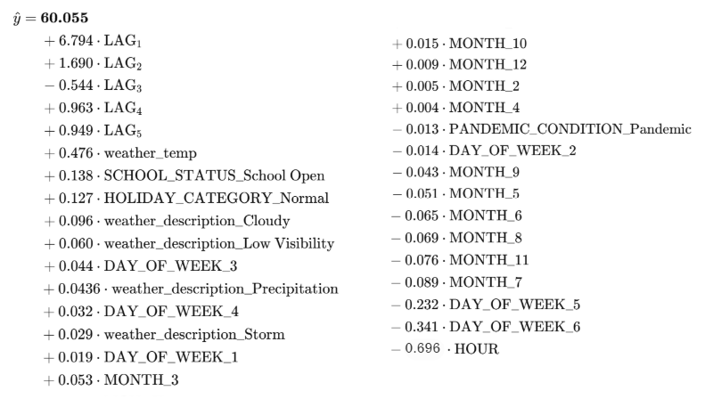
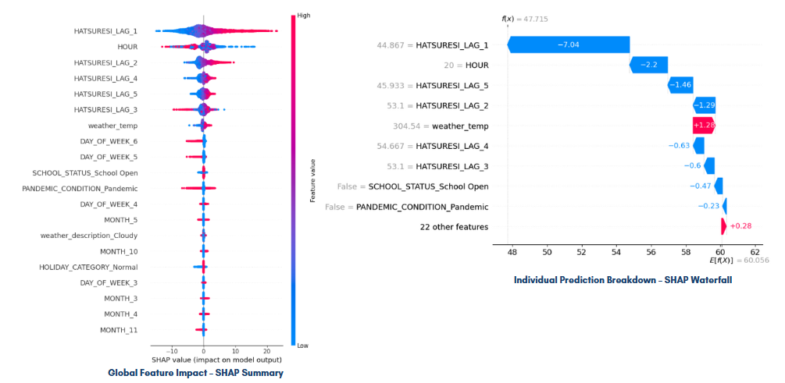
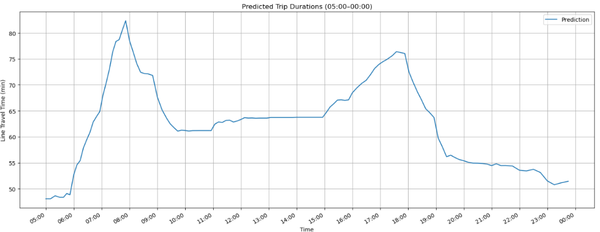

## 📊 Trip Duration Prediction Pipeline: Data Preparation, Modeling, and Validation

This repository contains the code and resources used for modeling bus trip durations using a structured machine learning pipeline developed.

### 🛠️ Data Preprocessing and Feature Engineering

* Raw trip data was cleaned by removing records with missing values and logically invalid durations.
* A new target variable, `HATSURESI` (trip duration in minutes), was computed from trip start and end timestamps.
* Trips were filtered to include only those within realistic operational bounds (35–97 minutes).
* **Local Outlier Factor (LOF)** was used to detect and remove anomalous trips not caught by duration filtering.

Additional features were engineered to improve model performance:

* **Temporal features**: Hour, day of the week, month.
* **Calendar indicators**: National holidays, school schedule (open/closed), COVID-19 pandemic periods.
* **Weather conditions**: Simplified weather categories and temperature were added per trip.
* **Lag features**: `HATSURESI_LAG_1` to `LAG_5` capture the durations of the five most recent trips at a stop, modeling short-term delay propagation.

All categorical variables were one-hot encoded. Multicollinearity was checked using the Variance Inflation Factor (VIF), ensuring all features were suitable for linear modeling.

#### 🔍 Final Feature Set

| Feature Name                    | Type     | Category            | Description                                  |
|--------------------------------|----------|---------------------|----------------------------------------------|
| weather_temp                   | float64  | Numerical (Cont.)   | Temperature at the time of the trip         |
| HOUR                           | int32    | Numerical (Discrete)| Hour of the day (0–23)                      |
| DAY_OF_WEEK_1 to 6             | bool     | One-Hot Encoded     | Day of the week (Monday–Saturday)           |
| HOLIDAY_CATEGORY_Holiday       | bool     | One-Hot Encoded     | Public holiday indicator                    |
| MONTH_2 to MONTH_12            | bool     | One-Hot Encoded     | Month (February–December)                   |
| PANDEMIC_CONDITION_Pandemic    | bool     | One-Hot Encoded     | COVID period indicator                      |
| SCHOOL_STATUS_Closed           | bool     | One-Hot Encoded     | School closed status                        |
| weather_description_Cloudy     | bool     | One-Hot Encoded     | Cloudy weather condition                    |
| weather_description_Low Vis.   | bool     | One-Hot Encoded     | Fog, mist, haze, etc.                       |
| weather_description_Storm      | bool     | One-Hot Encoded     | Storms, thunder, or tornadoes               |
| weather_description_Precip.    | bool     | One-Hot Encoded     | Rain or snow                                |
| HATSURESI_LAG_1 to LAG_5       | float64  | Lag Feature (Num.)  | Durations of previous 1–5 trips at a stop   |


### 🧠 Modeling Approach

* **Baseline model**: Linear regression showed poor performance without lag features (R² = 0.11).
* Adding lag variables improved the R² to **0.63**, with RMSE = **7.23** and MAPE = **8.07%**, highlighting the importance of short-term historical context.

#### 📉 Effect of Lag Features:

| Model              | R² Score | RMSE  | MAE  | MAPE (%) |
|-------------------|----------|-------|------|----------|
| Without LAG       | 0.1100   | 11.19 | 8.71 | 14.84    |
| With 5 LAG values | 0.6300   | 7.23  | 4.83 | 8.07     |

Lag features significantly boosted model performance, confirming the relevance of short-term memory in trip delays.

#### 📐 Linear Regression Model Formula

Below is the predicted value breakdown from the trained Linear Regression model. It shows the additive contributions of each feature (especially lag variables and hour of day) to the final trip duration prediction.



### 🌲 Ensemble Learning and Stacking

We tested several advanced models.

#### 📊 Model Comparison Table:

| Model                        | R² Score | RMSE | MAE  | MAPE (%) |
|-----------------------------|----------|------|------|----------|
| Linear Regression           | 0.6300   | 7.23 | 4.83 | 8.07     |
| XGBoost                     | 0.6906   | 6.55 | 4.31 | 7.14     |
| XGBoost – Grid Search       | 0.6967   | 6.49 | 4.26 | 7.06     |
| LightGBM                    | 0.6881   | 6.58 | 4.38 | 7.27     |
| LightGBM – Randomized Search| 0.6954   | 6.50 | 4.29 | 7.11     |
| CatBoost                    | 0.6971   | 6.48 | 4.24 | 7.02     |
| CatBoost – Randomized Search| **0.7015** | **6.45** | **4.19** | **6.94** |
| Stacking (XGB + CAT + LR)   | 0.6977   | 6.48 | 4.24 | 7.02     |
| Stacking – Grid Search      | 0.6961   | 6.49 | 4.26 | 7.06     |
| Stacking + Ridge            | 0.6977   | 6.48 | 4.24 | 7.01     |
| Stacking + Lasso            | 0.6977   | 6.48 | 4.24 | 7.02     |
| Random Forest               | 0.6871   | 6.59 | 4.25 | 7.06     |


### 🔍 Model Explainability with SHAP

* SHAP analysis confirmed the high importance of lag features (`HATSURESI_LAG_1`, `LAG_2`, etc.), followed by hour of day, temperature, and pandemic flags.
* Broader calendar features (month, weekday) had lower impact compared to real-time and recent-history features.



### ✅ Cross-Validation

* **5-Fold Cross-Validation** confirmed model robustness with an average R² = **0.7011**.
* A **full-day simulation** using the trained CatBoost model reproduced realistic traffic patterns, capturing morning/evening rush peaks and off-peak stability.
* Lag variables were dynamically updated during simulation to reflect real-time delay propagation.



# 🚌 Trip Duration Prediction using Ensemble Learning

This repository contains a complete end-to-end pipeline for predicting urban bus trip durations based on historical, temporal, weather, and contextual data. The pipeline integrates data cleaning, feature engineering, baseline and advanced modeling, and explainability using SHAP.

---

## 📁 Project Structure

```
├── datas/
│   ├── data.csv                        # Raw dataset provided by source
│   ├── cleaned_data.csv                # Cleaned dataset after preprocessing
│   ├── training_data.csv               # Final training-ready dataset
│   ├── predicted_trip_durations.xlsx   # Output of model predictions (simulation results)
├── DataCleaning.ipynb                  # Notebook for raw data exploration and cleaning
├── FeatureEngineering.ipynb           # Creation of temporal, weather, holiday, and lag features
├── Model_LinearRegression.ipynb       # Baseline regression model
├── Model_RandomForest.ipynb           # Random Forest model implementation
├── Model_CatBoost.ipynb               # CatBoost model (default and tuned)
├── Model_Best_Tuned_CatBoost.ipynb    # Best-tuned CatBoost with SHAP interpretation
├── Model_XGB-LightGBM.ipynb           # XGBoost and LightGBM implementations
├── Model_Stacking-XGBoost+CatBoost+...# Ensemble stacking with meta-learner
├── Make_Predictions.ipynb             # Full-day prediction simulation using trained model
├── requirements.txt                   # Python dependencies
```


## 📊 Notebooks Overview

| Notebook                          | Description                                                                 |
| --------------------------------- | --------------------------------------------------------------------------- |
| `DataCleaning.ipynb`              | Loads raw data, removes missing/invalid records, applies logical filtering. |
| `FeatureEngineering.ipynb`        | Generates temporal, holiday, weather, and lag-based features.               |
| `Model_LinearRegression.ipynb`    | Baseline linear regression model with and without lag features.             |
| `Model_RandomForest.ipynb`        | Random Forest implementation for non-linear modeling.                       |
| `Model_CatBoost.ipynb`            | CatBoost model with basic tuning.                                           |
| `Model_Best_Tuned_CatBoost.ipynb` | Best-performing model with full explainability.                        |
| `Model_XGB-LightGBM.ipynb`        | Gradient boosting implementations (XGBoost, LightGBM).                      |
| `Model_Stacking-...`              | Blending of top models (CatBoost, XGBoost) using Ridge meta-learner.        |
| `Make_Predictions.ipynb`          | Generates trip duration predictions across a simulated service day.         |

---

## ✅ Highlights

* **Lag Features**: 5-step memory for trip durations, capturing congestion patterns.
* **Contextual Awareness**: School schedule, national holidays, and pandemic periods modeled explicitly.
* **Explainability**: SHAP plots for model transparency.
* **Simulation**: Realistic full-day trip duration simulation using predicted lag propagation.

---

## 📈 Best Model Performance (CatBoost)

| Metric | Value        |
|--------|--------------|
| R²     | **0.7015**   |
| RMSE   | 6.45 minutes |
| MAE    | 4.19 minutes |
| MAPE   | 6.94%        |

**Tuned Parameters (via Randomized Search):**

| Depth | Iterations | Learning Rate | L2 Regularization |
|-------|------------|----------------|--------------------|
| 10    | 500        | 0.10           | 9                  |

---

## 📌 Requirements

* Python 3.8+
* CatBoost
* XGBoost
* LightGBM
* scikit-learn
* pandas
* SHAP
* matplotlib, seaborn

(Full list in `requirements.txt`)

---

## 📮 Output

* **`predicted_trip_durations.xlsx`** contains final model output for a simulated full-day schedule (05:00–00:00).
* Results align with observed peak hours and reflect realistic urban transit patterns.


